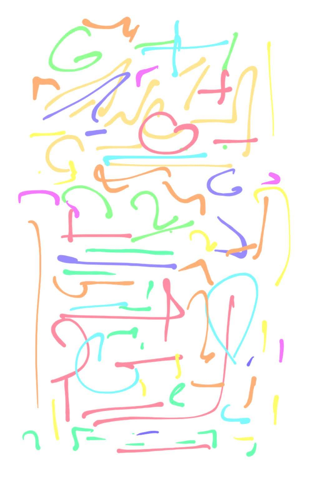

"Art"
=========================
Art is made from emotions that are genuinely poured in while making it, to achieve a goal to help care and love. It is painting, music, text, style of writing, coding skills, making stuff that defines the space around
with its aura. Tone and depth of color provides emotions which share care and support positively. It could sometimes be a mystery hunt, a slow burn or an impulse, all depends on the heat and urgency of the moement.

Science binds art and business(another art) by providing stability to it. Beings create meaning from correlations and patterns which gives them a sense of drive, to handle things.
Perception of surrondings which define one and their behavior on to the other one is subjective. However, the change they make onto others could be more stable or of a different timescale.
For e.g. here are two arts, one is made for a being while the other is an expensive travel dream. Could be easy to tell which is which!

 
